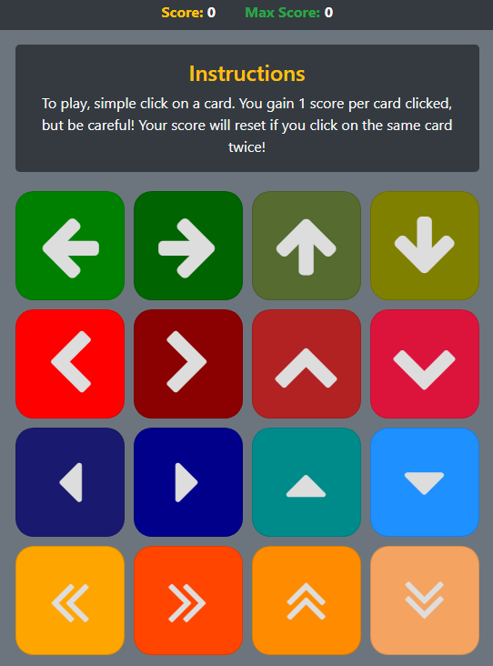

# Memory Game

**`Technologies Used:`** React, Node, Bootstrap, Javascript

## `Summary`

A simple memory game made with React. The game gradually gets harder because the cards are randomly shuffled after each click.

## `Highlights:`

- React
- Updating **Arrays** with **setState**
- Shuffle **Array** by **Destructuring**

## `Goals`

- Maybe turn this into a memory/match game. Or, just make a memory/match game.

## `Learning Experience`

- Learned to write in **React**
- Got way more comfortable with writing in **ES6**
- Learned to update **Arrays** with **setState**
- Learned to use **Components** and **Props**
- Learned inline styling

## `Screenshots`



## `Code Snippets`

**State Updates**

```
// do stuff when card is clicked
handleCardClick = i => {
// wrap score conditions in a promise
return new Promise(resolve => {
    // if card has already been clicked...
    if (this.state.cards[i].clicked) {
    // welp, user lost. restart!
    this.restartGame()
    } else {
    this.setState({
        cards: this.state.cards.map((card, index) => {
        // if current card index matches i
        if (index === i) {
            // change clicked to true
            card.clicked = true;
        }
        // return the card data back to array
        return card;
        }),
        score: this.state.score + 1,
    })
    // resolve so we can process the next step
    resolve()
    }
})
    // then...
    .then(() => {
    // max moves is 16, so..
    if (this.state.score === 16) {
        // restart if that's true
        this.restartGame();
    } else {
        // continue the game and shuffle if not
        this.shuffleCards();
    }
    })
}
```

**Array shuffling by destructuring**

```
// shuffles the cards around
shuffleCards = () => {
    // clone state.cards into temp
    let temp = this.state.cards.slice();

    // every day i shuffle!
    for (let day = temp.length - 1; day > 0; day--) {
        let i = Math.floor(Math.random() * (day + 1));
        [temp[day], temp[i]] = [temp[i], temp[day]]
    }

    // damn right you're shuffled!
    this.setState({ cards: temp })
}
```

**Component, Props, Inline Styling**

```
function Card(props) {

const style = {
    card: {
        background: props.color,
    },
    icon: {
        color: "#DDDDDD",
        fontSize: 75,
        margin: "auto",
        padding: 0
    }
}

return (
    <div className="card" style={style.card}>
        <i className={props.icon} style={style.icon}></i>
    </div>
)
}
```

## `Links`

LinkedIn: https://www.linkedin.com/in/kerwinhy/<br>
GitHub: https://github.com/seiretsym<br>

## `Deployed Site:`

GitHub Pages: https://seiretsym.github.io/memory-game
